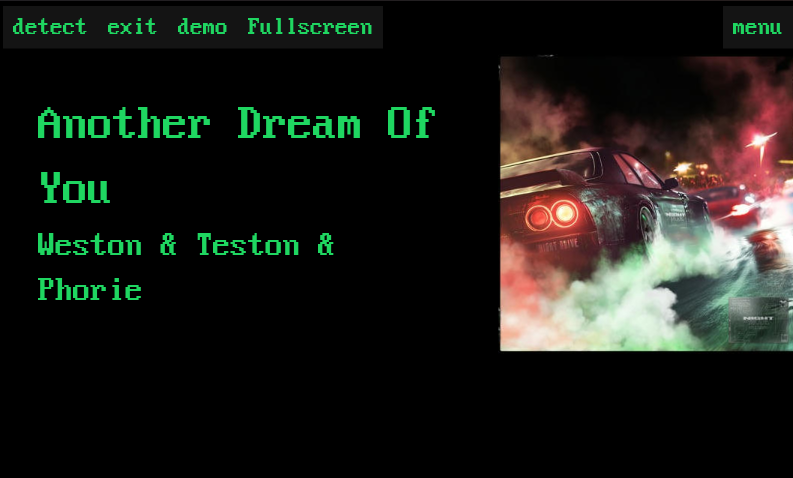

# IDDisplay

## about

This is a gui for song recognition using [ShazamIO](https://github.com/shazamio/ShazamIO) written in rust. The gui library i used is [iced](https://github.com/iced-rs/iced/tree/master).
It can display the current song by listening to sound and identifying it with Shazam. Or you can login with spotify and display the currently playing song on your account,

## Install

download and unzip the latest release and run the executable. The curently suported platforms are x86_64 windows and linux and arm64 linux.

## usage

Press the start button and wait until a song is recognized. It will try detect the song until you exit. When you press exit it might take a minute to close because it wants to end a blocking loop.
The default recording device will be used to lisen for music.
You can also use the spotify mode by pressing menu -> spotify. Then login by scanning the qr code. And then enable the spotify mode. It should not ask you to login every time. You can return to shazam mode in the menu under shazam.

## troubleshooting suggestions

- Check the volume of the default recording device.
- Try shazam on your phone in the same location as the microphone used for IDDisplay.
- Make sure no audio processing software is running like a noise gate.
- On linux make sure lx-dist-(arch)/ShazamIO/ShazamIO has execution permissions

## quirks and features

Some genres of music like Techno are verry hard to detect so the detected song might not be the song that is playing. This will happen more with songs witout lyrics.
Currently the recording time increases until it finds a song starting at 3s maxing out at 24s. I am working on settings page to tweak the configuration.

## tested setups

- Raspberry pi 4 with usb mic or ReSpeaker 2-Mics pHAT.
- Windows pc with usb mic.
- Linux pc with usb mic.
- Windows laptop with build in mic.